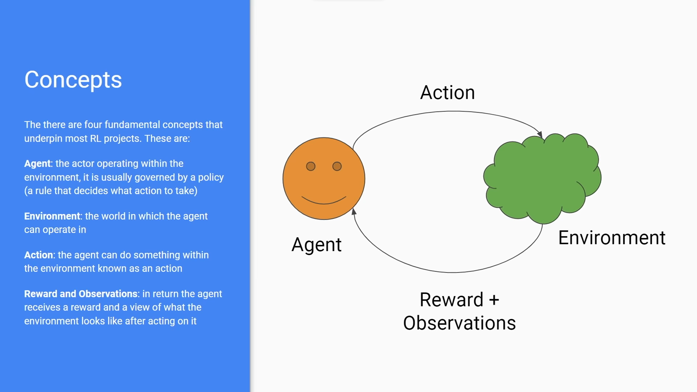

# Table of Contents

0. RL in a Nutshell
1. Setup
2. Environments
3. Training
4. Testing and Evaluation
5. Callbacks, Alt Algorithms, Architectures
6. Projects

    a. Breakout

    b. Self Driving

    c. Custom Environments

<hr>
<br>

# RL in a Nutshell

Reinforcement learning focuses on teaching agents through trial and error.


<br>

## Applications:
- Autonomous Driving
- Securities Trading
- Neural Network Architecture Search
- Simulated Training of Robots
- and much more


## Limitations and Considerations
- for simple problems, RL can be overkill
- Assumes the environment is Markovian
- Training can take a long time and is not always stable

<hr>
<br>

# Setup
 
## Installing Requred Dependencies

```
pip install stable_baselines3[extra]
```

